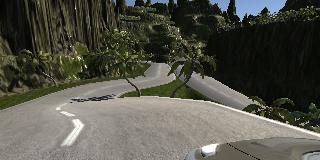

# **Behavioral Cloning Project** 

### Writeup of Dr. Miguel Aguilar
---

The goals / steps of this project are the following:

* Use the simulator to collect data of good driving behavior
* Build a convolution neural network in Keras that predicts steering angles from images
* Train and validate the model with a training and validation set
* Test that the model successfully drives around track one without leaving the road
* Summarize the results with a written report


[//]: # (Image References)

[image1]: ./images/cnn-architecture-624x890.png "Model"
[image2]: ./images/carnd-using-multiple-cameras.png "Cameras"
[image3]: ./images/track1_left.jpg "Track 1 left" 
[image4]: ./images/track1_center.jpg "Track 1 center"
[image5]: ./images/track1_right.jpg "Track 1 right"
[image6]: ./images/track2_left.jpg "Track 2 left"
[image7]: ./images/track2_center.jpg "Track 2 center"
[image8]: ./images/track2_right.jpg "Track 2 right"
[image9]: ./images/track2_center_flipped.jpg "Track 2 flipped"
[image10]: ./images/track1.png "Track 1"
[image11]: ./images/track2.png "Track 2"


The rubric with the specifications for this project can be found [here](https://review.udacity.com/#!/rubrics/432/view)

---
### Files Submitted

This project includes the following files:

* `model.py` containing the script to create and train the model
* `drive.py` for driving the car in autonomous mode (drive speed 15 MPH)
* `model.h5` containing a trained convolution neural network 
* `writeup.md` this report summarizing the results of this project
* `videos/track1.mp4` containing the video of the first mandatory track
* `videos/track2.mp4` containing the video of the second challenging optional track

### Model Architecture and Training Strategy

The following sections describe the architecture used to implement behavioral clonning and how the model was training to allow a car in the Udacity simulator to drive along two given tracks in autonomous mode.

#### 1. Model Architecture

The model architecture used in this project as a basis is the one proposed by NVIDIA [here](https://devblogs.nvidia.com/deep-learning-self-driving-cars/). The following figure shows this architecture, which consists of 9 layers, including a normalization layer, 5 convolutional layers, and 3 fully connected layers. 

![alt text][image1]

Source: [NVIDIA](https://devblogs.nvidia.com/deep-learning-self-driving-cars/)

This architecture was extended by cropping the image with the `Cropping2D(cropping=((70,25),(0,0))` call  (`model.py` line `89`) to focus on the road and avoid for example the sky and trees. Also adding RELU layers were added to introduce nonlinearity (`model.py` lines `92-96`). Finally, to reduce overfitting dropout layers were added with a 50% (`model.py` lines `100`, `102` and `104`).

In the following the summary of the architecture generated by Keras is shown:

```
_________________________________________________________________
Layer (type)                 Output Shape              Param #   
=================================================================
lambda_1 (Lambda)            (None, 160, 320, 3)       0         
_________________________________________________________________
cropping2d_1 (Cropping2D)    (None, 65, 320, 3)        0         
_________________________________________________________________
conv2d_1 (Conv2D)            (None, 31, 158, 24)       1824      
_________________________________________________________________
conv2d_2 (Conv2D)            (None, 14, 77, 36)        21636     
_________________________________________________________________
conv2d_3 (Conv2D)            (None, 5, 37, 48)         43248     
_________________________________________________________________
conv2d_4 (Conv2D)            (None, 3, 35, 64)         27712     
_________________________________________________________________
conv2d_5 (Conv2D)            (None, 1, 33, 64)         36928     
_________________________________________________________________
flatten_1 (Flatten)          (None, 2112)              0         
_________________________________________________________________
dropout_1 (Dropout)          (None, 2112)              0         
_________________________________________________________________
dense_1 (Dense)              (None, 100)               211300    
_________________________________________________________________
dropout_2 (Dropout)          (None, 100)               0         
_________________________________________________________________
dense_2 (Dense)              (None, 50)                5050      
_________________________________________________________________
dropout_3 (Dropout)          (None, 50)                0         
_________________________________________________________________
dense_3 (Dense)              (None, 10)                510       
_________________________________________________________________
dense_4 (Dense)              (None, 1)                 11        
=================================================================
Total params: 348,219
Trainable params: 348,219
Non-trainable params: 0
_________________________________________________________________
```

#### 2. Model parameter tuning

In the following is presented the selected values for the key training parameters

* Epochs: 5
* Batch size: 64
* Learning rate: The model used an adam optimizer, so the learning rate was not tuned manually (`model.py` line `108`)

#### 3. Appropriate training data

In this project, a combination of training data comming from the two tracks available in the Udacity's car [simulator](https://github.com/udacity/self-driving-car-sim) is used. For the first track, the data provided by Udacity [here](https://s3.amazonaws.com/video.udacity-data.com/topher/2016/December/584f6edd_data/data.zip) was used. For the second track, the Udacity simulator was used to gather data based on a combination of center lane driving, recovering from the left and right sides of the road to allow the model to properly generalize.

The training data coming from a single frontal camera in a car can be augmented to allow the model to generalize better while training it. One approach is by having multiple cameras to capture not just the central image but also images a bit off to the left and to the right. This allows to simulate the car vehicle being in different positions with respect to the middle of the lane. The following image shows the configuration of the cameras in the car.

![alt text][image2]

Source: Udacity

The simulator used in this project captures images from three cameras mounted on the car: a center, right and left camera. This approach results in having three times as much training data for the model with different stearing angles. The following figures show examples of pictures taken by the three cameras for both of the tracks available in the simulator.

**Track 1**

**Left Camera**

![alt text][image3]

**Center Camera**

![alt text][image4]

**Right Camera**

![alt text][image5]

**Track 2**

**Left Camera**



**Center Camera**

![alt text][image7]

**Right Camera**

![alt text][image8]

To further augment the training data set, a flipped version of each center image was added with the proper stearing angle. The following figures exemply this.

| Original Image            | Flipped Image             |
|:--------:|:------------:|
|![alt text][image7] | ![alt text][image9] |

Finally, the train and dev sets where divided into 80% and 20% of the training images. This resulted in 46592 training images and 11652 dev images.

#### 4. Simulation

The trained model was loaded for inference in the simulator with the `python drive.py model.h5` command. The simulator was configure to run in a 640x480 screen resolution in fastest mode. The following are two screenshots of the car driving in autonoumous mode in both tracks.

| Track 1             | Track 2              |
|:--------:|:------------:|
|![alt text][image10] | ![alt text][image11] |

The videos of recorded while the car was in autonomous mode are the following:

* [Track 1](./videos/track1.mp4)
* [Track 2](./videos/track2.mp4)

### Discussion

#### 1. Summary

In this project a deep neural network based on keras was implemented to perform behavioral cloning to drive a car autonomously. The car was able to drive in the two tracks available in the Udacity's car simulator. 

#### 2. Possible Improvements

While the car was able to complete the first track without any problems, the second track was more challenging. In the second track there are two lanes, so ideally the car should stay on the right lane. In this track, the trained model in the project was able to correctly drive the car mostly in the right lane; however, sometimes it drives on the left lane but then it recovers. To improve the driving performance in the second track more data is needed to ensure that the car learns to stay in the right lane. However, due to the limited Udacity GPU quota for this project it was not possible to perform further experiments to refine the model.

#### References

* Part of the code of this project was taken from lessons of the Self Driving Car Engineer Nanodegree of Udacity
* NVIDIA [model architecture](https://devblogs.nvidia.com/deep-learning-self-driving-cars/)